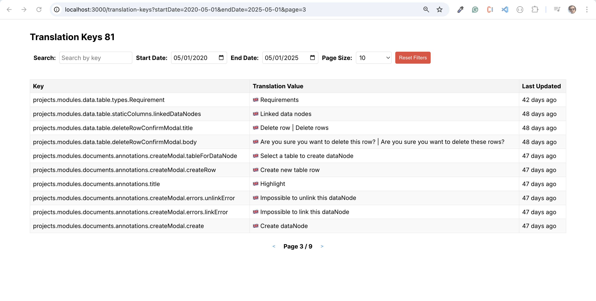

# Frontend Assessment

This project is a frontend application built with **Nuxt 3** and **TypeScript**. It includes a `/translation-keys` page that allows users to search, filter, and paginate through translation keys fetched from a backend API. The project is structured to ensure modularity, reusability, and maintainability.

---

## Implemented Design

## 

## Table of Contents

- [Folder Structure](#folder-structure)
- [Translation Keys Page](#translation-keys-page)
  - [Components](#components)
  - [Composable](#composable)
- [Atoms](#atoms)
- [Utilities](#utilities)
- [How to Run the Project](#how-to-run-the-project)

---

## Folder Structure

The project is organized into the following key folders:

- **`pages/`**: Contains the main pages of the application. Each page corresponds to a route.
- **`components/`**: Contains reusable components specific to a page or feature.
- **`atoms/`**: Contains small, reusable UI components (e.g., `tooltip`, `loading`, `translation`).
- **`composables/`**: Contains reusable logic and state management functions (e.g., `useTranslationKeys`).
- **`utils/`**: Contains utility functions for common tasks (e.g., `fetchWithRetry`, `formatRelativeTime`, `buildUrlWithParams`).
- **`test/`**: Contains unit tests for components, composables, and utilities.

---

## Translation Keys Page

The `Translation Keys` page is the main feature of this project. It allows users to:

- Search for translation keys by keyword.
- Filter translation keys by date range. (only runs when start and end are specified)
- Paginate through the results.
- View translation keys and their associated translations.
- Filters are written and read through the URL so a specific filter view can be shared, this also allows refreshes and better overall UX

### Components

The `Translation Keys` page is composed of the following components:

1. **`search-filters.vue`**:

   - Allows users to input a search query, select a date range, and choose the number of results per page.
   - Emits events to update the search query, date range, and page size.
   - Includes a "Reset Filters" button to clear all filters.

2. **`translation-keys-table.vue`**:

   - Displays the list of translation keys in a table format.
   - Shows the key, translation values, and the last updated time.
   - Uses the `tooltip` atom to display all translations for a key when hovered.

3. **`pagination.vue`**:
   - Provides navigation controls for paginating through the results.
   - Displays the current page and total pages.
   - Emits events to increment or decrement the current page.

### Composable

The `useTranslationKeys` composable manages the state and logic for the `Translation Keys` page. It includes:

- **State**: `translationKeys`, `isLoading`, `error`, `searchQuery`, `dateRange`, `currentPage`, `pageSize`, and `totalCount`.
- **Methods**:
  - `fetchTranslationKeys`: Fetches translation keys and their total count from the API.
  - `handleSearchQueryChange`: Updates the search query and fetches results.
  - `handleDateRangeChange`: Updates the date range and fetches results.
  - `handlePageSizeChange`: Updates the page size and fetches results.
  - `handlePageIncrement` / `handlePageDecrement`: Navigates to the next or previous page.
  - `resetFilters`: Resets all filters to their default values.

---

## Atoms

Atoms are small, reusable UI components used across the application. Key atoms include:

1. **`tooltip.vue`**:

   - Displays additional information when hovered.
   - Used in the `translation-keys-table` to show all translations for a key.

2. **`loading.vue`**:

   - Displays a loading spinner with a "Loading..." message.
   - Used in the `translation-keys-table` and other components to indicate loading states.

3. **`translation.vue`**:
   - Displays a translation value along with its associated language flag.
   - Maps language codes (e.g., `en-GB`) to flags (e.g., 🇬🇧).

---

## Utilities

The `utils/` folder contains helper functions to simplify common tasks:

1. **`fetchWithRetry.ts`**:

   - A wrapper around the `fetch` API that retries requests on failure.
   - Configurable with retry count and delay.

2. **`formatRelativeTime.ts`**:

   - Formats a date string into a human-readable relative time (e.g., "5 minutes ago").

3. **`urlBuilder.ts`**:

   - Constructs a URL with query parameters from a base URL and a params object.

4. **`debounce.ts`**:
   - Classic debounce function, used to aggregate the characters typed by user in a short amount of time and reduce number of API calls.

---

## How to Run the Project

Follow these steps to run the project locally:

### Prerequisites

- **Node.js**: Ensure you have Node.js installed (v16 or higher is recommended).
- **Package Manager**: Use `npm` or `yarn`.

### Steps

1. **Clone the Repository**:

   ```bash
   git clone git@github.com:SoroushOwji/goose.git
   cd frontend-assessment-main
   ```

2. **Install Dependencies**:

   ```bash
   npm install
   ```

3. **Run the Development Server**:

   ```bash
   npm run dev
   ```

   This will start the Nuxt development server. Open [http://localhost:3000](http://localhost:3000) in your browser.

4. **Run Tests**:

   - **Unit Tests**:
     ```bash
     npm run test:unit
     ```

5. **Build for Production**:

   ```bash
   npm run build
   ```

6. **Preview the Production Build**:
   ```bash
   npm run preview
   ```

---

## Notes

- The project uses **Vitest** for unit testing.
- Ensure the backend API is accessible for the `Translation Keys` page to function correctly.
- The folder structure and modular design make it easy to extend and maintain the project.
